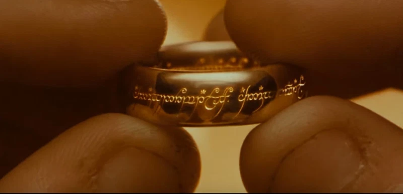
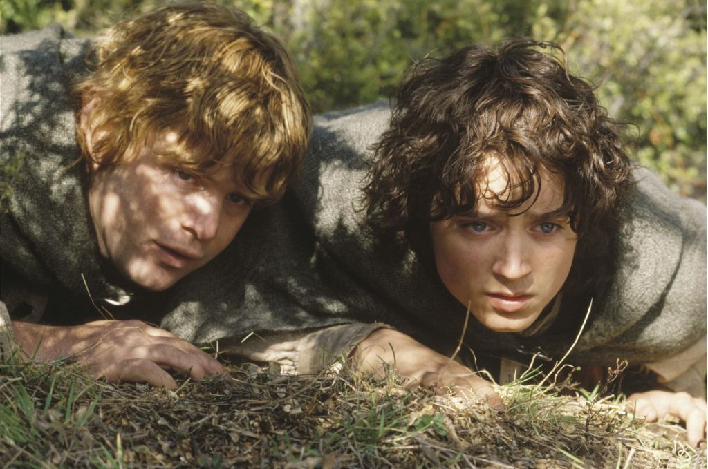

#### Lord of the Rings is not dead! 

While Amazon has become an Emmys juggernaut with more intimate series like “Fleabag” and “Marvelous Mrs. Maisel,” those kind of character-based stories are not all the streaming service does – or plans to do. And no upcoming series proves that point more than Amazon’s long-awaited, multi-season television adaptation of J.R.R. Tolkien’s “The Lord of the Rings.”

Since it was originally announced in 2017, news about the show has come in fits and starts. In recent months, 20 new cast members had joined the project, and a synopsis of the series was reported by TheOneRing.net. In that synopsis, it confirms that locations that will be included in the series are Númenor, the Misty Mountains, and the elf-capital of Lindon. The story will take place in Tolkien’s Second Age era, millennia before the events of “The Hobbit.”
- - -
> It Cost a Pretty Penny to Make Middle-earth a Reality (Again)

And while there’s still no trailer or concrete release date for the show, but a handful of other noteworthy details about the series have been released since its announcement. Perhaps the most startling? That the total price tag for the first season of the show is estimated to come in at $450 million. (By comparison, a season of “Game of Thrones” was estimated to cost $90 million, or about $15 million an episode.) According to New Zealand publication Stuff, the amount was ascertained by the NZ$160 million tax credit the production will receive for filming in the country. To receive a tax credit of that amount, the budget is estimated to come in at just shy of half a billion American dollars.

#### The Lord of the Rings' movies in the chronological order:

| `Number` | `Title`                                       | `Year` |
| :----- | :-------------------------------------------- | ---: |
|        |                                               |      |
| 1      | The Hobbit: An Unexpected Journey             | 2012 |
| 2      | The Hobbit: The Desolation of Smaug           | 2013 |
| 3      | The Hobbit: The Battle of the Five Armies     | 2014 |
| 4      | Lord of the Rings: The fellowship of the Ring | 2001 |
| 5      | Lord of the Rings: The Two Towers             | 2002 |
| 6      | Lord of the Rings: The Return of the King     | 2003 |

> Lorem ipsum dolor sit amet, consectetuer adipiscing elit. Aliquam hendrerit mi posuere lectus. Vestibulum enim wisi, viverra nec, fringilla in, laoreet vitae, risus.
> Lorem ipsum dolor sit amet, consectetuer adipiscing elit. Aliquam hendrerit mi posuere lectus. Vestibulum enim wisi, viverra nec, fringilla in, laoreet vitae, risus.